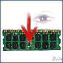

# The WinPmem memory acquisition driver and userspace.

WinPmem has been the default open source memory acquisition driver for
windows for a long time. It used to live in the Rekall project, but
has recently been separated into its own repository.

## Copyright

This code was originally developed within Google but was released
under the Apache License.

### Description

WinPmem is a physical memory acquisition tool with the following features:

- Open source

- Support for WinXP - Win 10, x86 + x64. The WDK7600 can be used to
  include WinXP support.
  As default, the provided WinPmem executables will be compiled with WDK10,
  supporting Win7 - Win10, and featuring more modern code.

- Three different independent methods to create a memory dump.
  One method should always work even when faced with kernel mode rootkits.

- Raw memory dump image support.

- A read device interface is used instead of writing the image from the kernel
  like some other imagers. This allows us to have complex userspace imager
  (e.g. copy across network, hash etc), as well as run analysis on the live
  system (e.g. can be run directly on the device).

The files in this directory (Including the WinPmem sources and signed binaries),
are available under the following license: Apache License, Version 2.0

### How to use

There are two WinPmem executables: winpmem_mini_x86.exe and winpmem_mini_x64.exe.
Both versions contain both drivers (32 and 64 bit versions).

The mini in the binary name refers to this imager being a plain simple
imager - it can only produce images in RAW format. In the past we
release a WinPmem imager based on AFF4 but that one is yet to be updated to the new driver. Please let us know if you need the AFF4 based imager.

### The Python acquisition tool winpmem.py

The python program is currently under construction but works as a demonstration for how one can use the imager from Python.

### winpmem_mini_x64.exe (standalone executable)

This program is easiest to use for incident response since it requires no other
dependencies than the executable itself. The program will load the correct
driver (32 bit or 64 bit) automatically and is self-contained.

##### Examples:

`winpmem_mini_x64.exe physmem.raw`

Writes a raw image to physmem.raw using the default method of acquisition.

`winpmem_mini_x64.exe`

Invokes the usage print / short manual.

To acquire a raw image using specifically the MmMapIoSpace method:

`winpmem.exe -1 myimage.raw`

The driver will be automatically unloaded after the image is acquired!

Experimental write support
--------------------------

The WinPmem source code supports writing to memory as well as reading.
This capability is a great learning tool since many rootkit hiding
techniques can be emulated by writing to memory directly.

This functionality should be used with extreme caution!

NOTE: Since this is a rather dangerous capability, the signed binary
drivers have write support disabled. You can rebuild the drivers to
produce test signed binaries if you want to use this feature. The
unsigned binaries (really self signed with a test certificate) can not
load on a regular system due to them being test self signed, but you can
allow the unsigned drivers to be loaded on a test system by issuing
(see
https://docs.microsoft.com/en-us/windows-hardware/drivers/install/the-testsigning-boot-configuration-option:

`Bcdedit.exe -set TESTSIGNING ON`

and reboot. You will see a small "Test Mode" text on the desktop to remind you
that this machine is configured for test signed drivers.

Additionally, Write support must also be enabled at load time:

`winpmem.exe -w -l`

This will load the drivers and turn on write support.

# Acknowledgments

This project would also not be possible without support from the wider
DFIR community:

* We would like to thank Emre Tinaztepe and Mehmet GÖKSU at
[Binalyze](https://binalyze.com/).

Our open source contributors:

* Viviane Zwanger
* Mike Cohen
